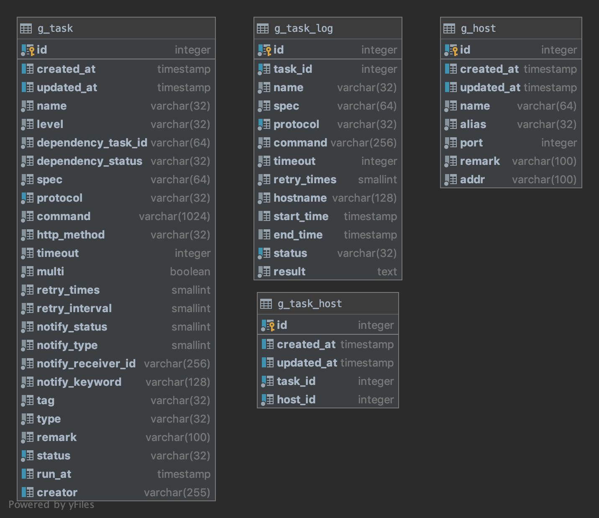

# gocron

使用Go语言开发的轻量级定时任务集中调度和管理系统

## 功能特性

* 支持任务类型
  * `cronjob` (crontab时间表达式), 
  * `job` ( run once, 创建成功立即执行，且只执行一次 ), 
  * `planjob` ( 计划任务，在指定时间执行任务，且只执行一次 )
* 任务执行失败可重试
* 任务执行超时，强制结束
* 支持 `shell` 和 `http` 任务
* 支持在多节点执行任务
* 支持任务日志

## 持久化数据库

* mysql
* postgres

## 数据表结构



## 部署

### docker-compose部署

1. `docker-compose up -d`

### k8s部署

1. `kubectl create ns gocron`
2. `kubectl apply -f deployment/deploy.yaml -n gocron`

## Api测试例子

1. 添加node节点

   ```shell
   curl --location --request POST 'localhost:8080/api/system/v1/nodes' \
   -H 'Content-Type: application/json' \
   -d '{
       "name": "node1",
       "alias": "test",
       "port": 8080,
       "addr": "192.168.234.137"
   }'
   ```

2. 查看node节点

   ```shell
   curl --location --request GET 'localhost:8080/api/system/v1/nodes'
   
   # 返回body
   {
       "items": [
           {
               "id": 1,
               "create_time": "2020-09-07T14:03:41+08:00",
               "update_time": "2020-09-07T14:03:41+08:00",
               "name": "node1",
               "alias": "test",
               "port": 8080,
               "addr": "192.168.234.137"
           }
       ],
       "total_count": 1
   }
   ```

3. ping node节点

   ```shell
   curl --location --request GET 'localhost:8080/api/system/v1/nodes/1/ping'
   
   # 返回200表示节点连接正常
   ```

4. 创建planjob类型的task

   ```shell
   curl --location --request POST 'localhost:8080/api/core/v1/tasks' \
   -H 'Content-Type: application/json' \
   -d '{
     "command": "echo \"hello world\"",
     "dependency_status": "strong",
     "dependency_task_id": "",
     "hosts": "1",
     "http_method": "",
     "level": "parent",
     "multi": false,
     "name": "test6",
     "protocol": "shell",
     "remark": "test task",
     "retry_interval": 10,
     "retry_times": 1,
     "spec": "",
     "tag": "test",
     "timeout": 100,
     "type": "planjob",
     "run_at": "2020-09-07T06:13:00Z"
   }'
   ```

5. 创建job类型的task

   ```shell
   curl --location --request POST 'localhost:8080/api/core/v1/tasks' \
   -H 'Content-Type: application/json' \
   -d '{
     "command": "echo \"hello world\"",
     "dependency_status": "strong",
     "dependency_task_id": "",
     "hosts": "1",
     "http_method": "",
     "level": "parent",
     "multi": false,
     "name": "test2",
     "protocol": "shell",
     "remark": "test task",
     "retry_interval": 10,
     "retry_times": 1,
     "spec": "",
     "tag": "test",
     "timeout": 100,
     "type": "job"
   }'
   ```

6. 创建cronjob类型的task

   ```shell
   curl --location --request POST 'localhost:8080/api/core/v1/tasks' \
   -H 'Content-Type: application/json' \
   -d '{
     "command": "echo \"hello world\"",
     "dependency_status": "strong",
     "dependency_task_id": "",
     "hosts": "1",
     "http_method": "",
     "level": "parent",
     "multi": false,
     "name": "test3",
     "protocol": "shell",
     "remark": "test task",
     "retry_interval": 10,
     "retry_times": 1,
     "spec": "1 * * * *",
     "tag": "test",
     "timeout": 100,
     "type": "cronjob"
   }'
   ```

7. 查看task

   ```shell
   curl --location --request GET 'localhost:8080/api/core/v1/tasks?paging=limit=1,page=1'
   
   ## 返回body
   {
       "items": [
           {
               "id": 3,
               "create_time": "2020-09-07T14:19:18+08:00",
               "update_time": "2020-09-07T14:19:18+08:00",
               "name": "test3",
               "level": "parent",
               "dependency_status": "strong",
               "spec": "1 * * * *",
               "protocol": "shell",
               "command": "echo \"hello world\"",
               "timeout": 100,
               "retry_times": 1,
               "retry_interval": 10,
               "tag": "test",
               "type": "cronjob",
               "remark": "test task",
               "status": "enabled",
               "next_run_time": "2020-09-07T14:22:01+08:00",
               "hosts": [
                   {
                       "id": 3,
                       "host_id": 1,
                       "name": "node4",
                       "port": 8080,
                       "alias": "test",
                       "addr": "192.168.234.137"
                   }
               ]
           },
           {
               "id": 2,
               "create_time": "2020-09-07T14:18:15+08:00",
               "update_time": "2020-09-07T14:18:15+08:00",
               "name": "test2",
               "level": "parent",
               "dependency_status": "strong",
               "protocol": "shell",
               "command": "echo \"hello world\"",
               "timeout": 100,
               "retry_times": 1,
               "retry_interval": 10,
               "tag": "test",
               "type": "job",
               "remark": "test task",
               "status": "enabled",
               "hosts": [
                   {
                       "id": 2,
                       "host_id": 1,
                       "name": "node4",
                       "port": 8080,
                       "alias": "test",
                       "addr": "192.168.234.137"
                   }
               ]
           },
           {
               "id": 1,
               "create_time": "2020-09-07T14:11:18+08:00",
               "update_time": "2020-09-07T14:11:18+08:00",
               "name": "test6",
               "level": "parent",
               "dependency_status": "strong",
               "protocol": "shell",
               "command": "echo \"hello world\"",
               "timeout": 100,
               "retry_times": 1,
               "retry_interval": 10,
               "tag": "test",
               "type": "planjob",
               "remark": "test task",
               "status": "enabled",
               "run_at": "2020-09-07T14:13:00+08:00",
               "hosts": [
                   {
                       "id": 1,
                       "host_id": 1,
                       "name": "node4",
                       "port": 8080,
                       "alias": "test",
                       "addr": "192.168.234.137"
                   }
               ]
           }
       ],
       "total_count": 3
   }
   ```

8. 查看task1的运行日志

   ```shell
   curl --location --request GET 'localhost:8080/api/core/v1/tasks/1/logs'
   
   ## 返回body
   {
       "items": [
           {
               "id": 1,
               "task_id": 1,
               "name": "test6",
               "spec": "",
               "protocol": "shell",
               "command": "echo \"hello world\"",
               "timeout": 100,
               "retry_times": 0,
               "hostname": "test - node4<br>",
               "start_time": "2020-09-07T14:12:59+08:00",
               "end_time": "2020-09-07T14:12:59+08:00",
               "status": "finish",
               "result": "主机: [test-node4:8080]\n\nhello world\n\n\n",
               "total_time": 0
           }
       ],
       "total_count": 1
   }
   ```

其他api使用案例可查看代码根目录 `gocron.postman_collection.json`文件，导入 `postman` 等工具

